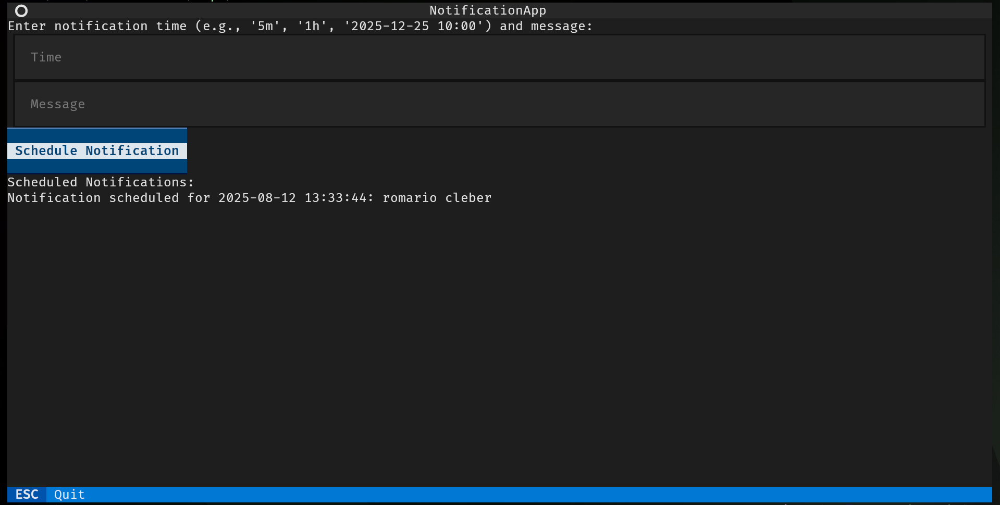

<a id="readme-top"></a>

# tui-notifier 
[](https://textual.textualize.io/) [](https://www.python.org/) [](https://opensource.org/licenses/MIT)

`tui-notifier` is a terminal-based application that allows you to schedule notifications directly from your command line.

<details>
  <summary>Table of Contents</summary>
  <ol>
    <li><a href="#about-the-project">About The Project</a></li>
    <li>
      <a href="#installation">Installation</a>
    </li>
    <li><a href="#usage">Usage</a></li>
  </ol>
</details>

## Preview




## Installation

The `flake.nix` file allows this project to be used as a Nix package. You can add it to your NixOS or Home Manager configuration.

1.  **Add `tui-notifier` to your flake inputs**

    ```nix
    # flake.nix
    inputs = {
      # ... other inputs
      tui-notifier.url = "github:castrozan/tui-notifier/<tag>";
    };
    ```

2.  **Enable the package in your Home Manager configuration**

    ```nix
    # home.nix
    { pkgs, inputs, ... }:
    {
      home.packages = [
        inputs.tui-notifier.packages.${pkgs.system}.default
      ];
    }
    ```

## Usage

Run the application with:

```sh
tui-notifier
```

## Development

The `devenv.nix` file provides a reproducible development environment with all the necessary dependencies and usefull commands.

```sh
devenv shell
```
